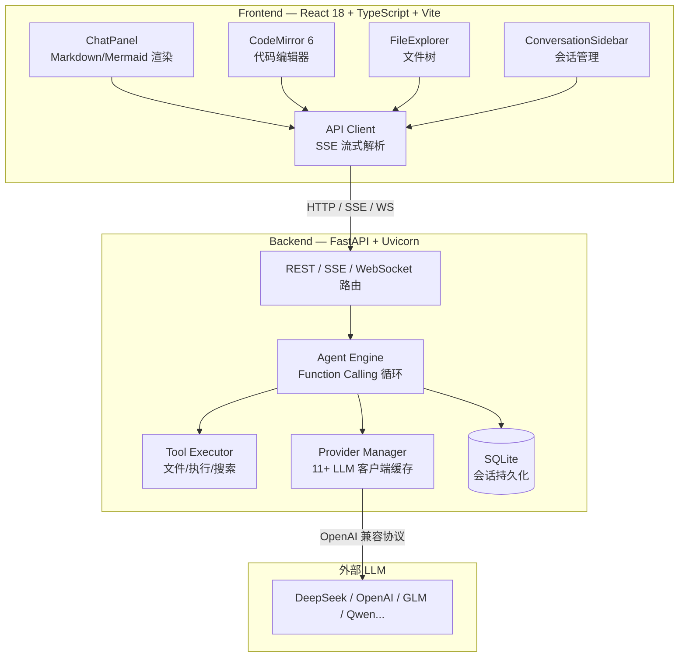
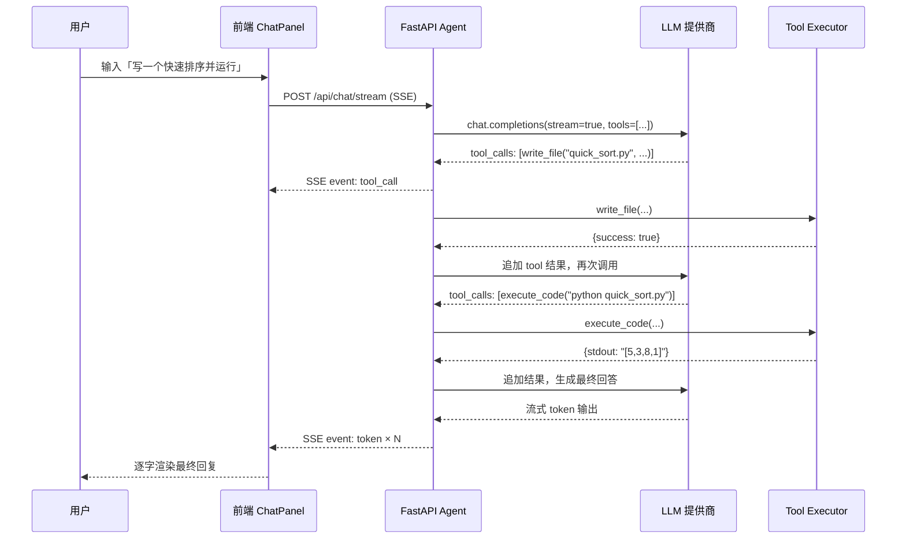

# CodeX Agent

<p align="center">
  <strong>一个从零构建的全栈 AI 编程助手 —— 基于 Function Calling 的自主 Agent，支持多模型、流式对话、代码沙箱执行与文件管理。</strong>
</p>

<p align="center">
  <a href="#-项目亮点"></a>
  <a href="https://github.com/wyqsgy/codex-agent/blob/main/LICENSE"></a>
  
  
  
  
  
  
  
  
</p>

---

## 项目背景

CodeX Agent 不是一个"套壳 GPT"的聊天机器人。它的核心是一套**可自主决策的 Agent 引擎**：大语言模型通过 **原生 Function Calling** 感知环境（文件系统、代码运行时），规划并执行多步工具调用直到完成任务 —— 而不是简单地补全文本。

这个项目是一次完整的**全栈工程实践**，覆盖了从 Agent 架构设计、Python 异步后端、SSE 流式传输、SQLite 持久化，到 React/TypeScript 前端、CodeMirror 编辑器、Docker 容器化与 CI/CD 的完整链路。

## ✨ 项目亮点

- **原生 Function Calling Agent 循环**：LLM 通过工具调用自主规划（最大 8 轮迭代），支持指数退避重试，而非用正则解析文本"伪工具调用"
- **真正的流式体验**：SSE + WebSocket 双通道，Token 级流式输出，工具调用状态实时推送，支持中途取消
- **代码沙箱执行**：基于 `asyncio.create_subprocess_exec` 的子进程隔离，带超时、输出截断与运行时探测
- **多层安全防护**：目录穿越拦截（`safe_path`）、频率限制、API Key 环境变量隔离、Docker 非 root 运行
- **多模型热切换**：内置 11 家提供商（DeepSeek / OpenAI / 智谱 / 通义 / Kimi / 百川…），支持自定义 OpenAI 兼容端点
- **可观测性**：请求 ID 追踪、耗时统计、`/api/stats` 运行指标端点、结构化日志
- **会话导出**：一键导出对话为 Markdown 或 JSON
- **图表渲染**：对话中直接渲染 Mermaid 流程图、时序图、甘特图等

## 📐 系统架构



### 一次工具调用的完整时序



## 🧠 核心特性详解

### 1. Agent 工具调用循环

```python
# agent.py — 核心循环（简化）
for _ in range(MAX_TOOL_ITERATIONS):      # 最多 8 轮
    response = client.chat.completions.create(messages=..., tools=TOOL_DEFINITIONS)
    choice = response.choices[0]

    if not choice.message.tool_calls:
        break                              # 无工具调用 = 任务完成

    for tc in choice.message.tool_calls:
        result = await call_tool(tc.function.name, json.loads(tc.function.arguments))
        messages.append({                 # 将工具结果回填给 LLM
            "role": "tool",
            "tool_call_id": tc.id,
            "content": json.dumps(result),
        })
```

### 2. 安全防护设计

| 威胁 | 防护措施 | 实现位置 |
|------|---------|---------|
| 目录穿越攻击 | `safe_path()` 规范化路径 + 前缀校验 | `tools.py` |
| 二进制/大文件读取 | 扩展名黑名单 + 5MB 大小限制 | `tools.py` |
| 请求滥用 | 60 次/分钟的滑动窗口限流 | `main.py` |
| 密钥泄露 | API Key 仅从环境变量或加密配置读取 | `config.py` |
| 容器逃逸 | Docker 非 root 用户 + 最小镜像 | `Dockerfile` |
| 代码执行逃逸 | 子进程隔离 + 超时 + 输出截断 | `tools.py` |

### 3. 多模型 Provider 架构

采用「配置驱动」的设计，新增一个模型提供商**无需改动代码**，只需在 `providers.json` 中添加配置项即可。所有提供商统一走 OpenAI 兼容协议，通过 `AsyncOpenAI` / `OpenAI` 客户端调用，并按 `provider_id` 做客户端缓存，避免重复创建连接。

## 🛠 技术栈

| 层 | 技术 | 选型理由 |
|----|------|---------|
| 后端框架 | FastAPI + Uvicorn | 原生异步、自动 OpenAPI 文档、SSE/WS 支持 |
| Agent | OpenAI SDK (Function Calling) | 统一多提供商兼容层 |
| 数据库 | SQLite (aiosqlite) | 零部署、适合单机持久化 |
| 前端 | React 18 + TypeScript 5 | 类型安全 + 组件化 |
| 构建 | Vite 5 | 极速 HMR + 代码分割 |
| 编辑器 | CodeMirror 6 | 模块化、支持 8 种语言 |
| 样式 | Tailwind CSS 3 | 原子化 CSS，快速迭代 |
| Markdown | react-markdown + remark-gfm | 表格/引用/任务列表 |
| 图表 | Mermaid 11 | 对话内渲染流程图/时序图 |
| 部署 | Docker 多阶段构建 | 镜像瘦身 + 非 root 运行 |

## 🚀 快速开始

### 前置要求

- Python 3.11+
- Node.js 18+（本地执行 JS/TS 代码需要）
- （可选）Docker & Docker Compose

### 方式一：Docker 部署（推荐）

```bash
# 1. 配置 API Key
cp backend/.env.example backend/.env
# 编辑 backend/.env 填入你的 API Key

# 2. 一键启动
docker compose up --build
```

访问 `http://localhost:8000/docs` 查看交互式 API 文档。

### 方式二：本地开发

```bash
# 后端
cd backend
pip install -r requirements.txt
cp .env.example .env          # 填入 API Key
python -m uvicorn main:app --host 0.0.0.0 --port 8000 --reload

# 前端（新终端）
cd frontend
npm install
npm run dev
```

前端 `http://localhost:5173`，通过 Vite proxy 将 `/api` 转发到后端。

## 📚 API 接口

| 方法 | 路径 | 说明 |
|------|------|------|
| `POST` | `/api/chat` | 对话（非流式） |
| `POST` | `/api/chat/stream` | 对话（SSE 流式） |
| `GET` | `/api/conversations` | 会话列表 |
| `GET` | `/api/conversations/{id}` | 会话详情 |
| `DELETE` | `/api/conversations/{id}` | 删除会话 |
| `GET` | `/api/files` | 文件列表 |
| `POST` | `/api/files/read` | 读取文件 |
| `POST` | `/api/files/write` | 写入文件 |
| `POST` | `/api/files/delete` | 删除文件 |
| `POST` | `/api/execute` | 执行代码 |
| `POST` | `/api/search` | 搜索代码 |
| `GET` | `/api/providers` | 提供商列表 |
| `POST` | `/api/providers/configure` | 配置提供商 |
| `GET` | `/api/providers/{id}/test` | 测试连接 |
| `GET` | `/api/stats` | 运行统计（请求数/运行时间/活跃连接） |
| `GET` | `/api/health` | 健康检查 |
| `WS` | `/ws/chat` | WebSocket 对话 |

## 🧪 测试

项目包含完整的单元测试与集成测试，覆盖工具层、Agent 引擎与 API 层，**整体覆盖率约 70%**。

```bash
cd backend
pip install -r requirements-dev.txt

pytest                          # 运行全部测试
pytest --cov=. --cov-report=term-missing   # 查看覆盖率明细
```

测试覆盖的关键场景：
- ✅ 路径穿越攻击（`../`、绝对路径、多级穿越）
- ✅ 二进制文件读取拦截
- ✅ 代码执行超时与不支持语言
- ✅ 文件增删改查
- ✅ API 限流（429）
- ✅ 会话持久化与恢复

## 🔑 键盘快捷键

| 快捷键 | 功能 |
|--------|------|
| `Ctrl+S` | 保存当前文件 |
| `Ctrl+N` | 新建文件 |
| `Ctrl+B` | 切换侧边栏 |
| `Ctrl+E` | 切换编辑器/聊天 |
| `Ctrl+K` | 新建会话 |
| `Enter` | 发送消息 |
| `Shift+Enter` | 换行 |

## 📁 项目结构

```
codex-agent/
├── backend/                       # FastAPI 后端
│   ├── main.py                    # 路由、中间件、SSE/WS
│   ├── agent.py                   # Agent 引擎（Function Calling 循环）
│   ├── tools.py                   # 工具实现 + 安全防护
│   ├── config.py                  # 配置与提供商管理
│   ├── models.py                  # Pydantic 数据模型
│   ├── providers.json             # 内置 11 家模型提供商
│   ├── requirements.txt           # 生产依赖
│   ├── requirements-dev.txt       # 测试依赖
│   └── tests/                     # 单元测试 + 集成测试
│       ├── test_agent.py          # Agent 引擎测试
│       ├── test_tools.py          # 工具层测试（含安全）
│       └── test_api.py            # API 集成测试
├── frontend/                      # React 前端
│   └── src/
│       ├── App.tsx                # 主应用（状态管理/布局）
│       ├── api.ts                 # API 客户端 + SSE 流式处理
│       ├── types.ts               # TypeScript 类型定义
│       └── components/
│           ├── ChatPanel.tsx      # 聊天面板（Markdown/Mermaid/导出）
│           ├── ConversationSidebar.tsx  # 会话侧边栏
│           ├── CodeEditor.tsx     # 代码编辑器（CodeMirror 6）
│           ├── FileExplorer.tsx   # 文件浏览器
│           ├── MermaidDiagram.tsx # Mermaid 图表渲染
│           ├── StatusBar.tsx      # 状态栏
│           ├── ErrorBoundary.tsx  # 错误边界
│           └── Toast.tsx          # 通知组件
├── .github/workflows/ci.yml       # CI/CD（pytest + tsc + build）
├── Dockerfile                     # 多阶段构建（非 root 运行）
├── docker-compose.yml             # 一键部署
└── workspace/                     # 默认工作区
```

## 🐳 部署架构

Docker 采用**多阶段构建**：

1. **Stage 1（构建前端）**：`node:20-alpine` 编译生成静态资源
2. **Stage 2（运行时）**：`python:3.11-slim` 仅保留运行时依赖，安装 Node.js 用于 JS/TS 代码执行
3. **安全加固**：创建非 root 用户运行，健康检查探针，数据卷持久化

## 📜 License

[MIT](LICENSE) © 2026 wyqsgy