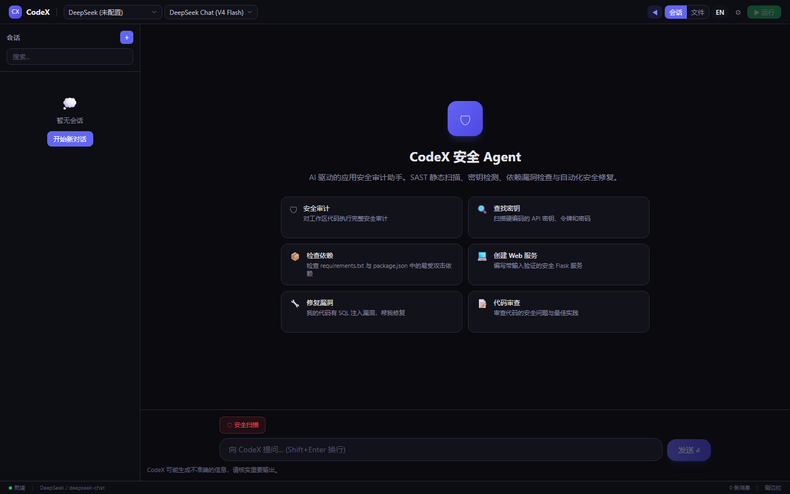
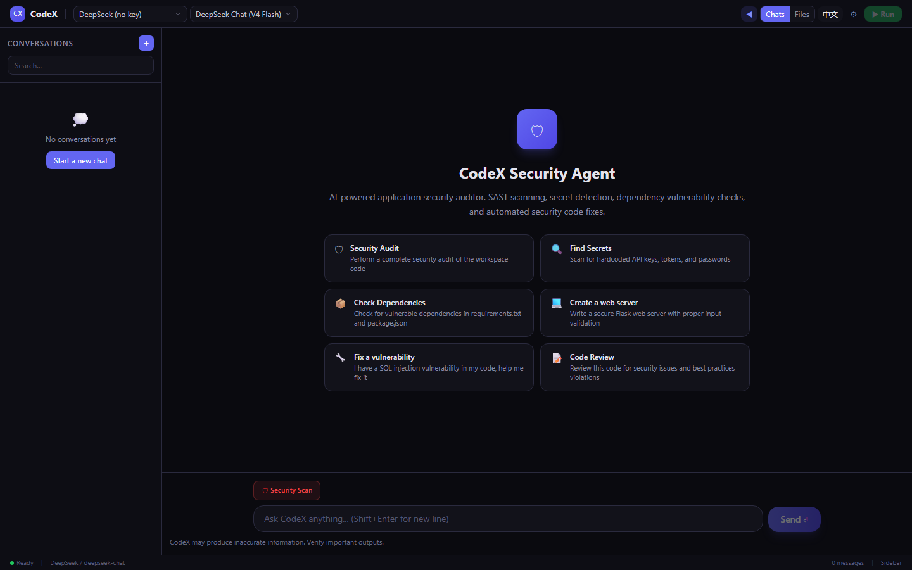
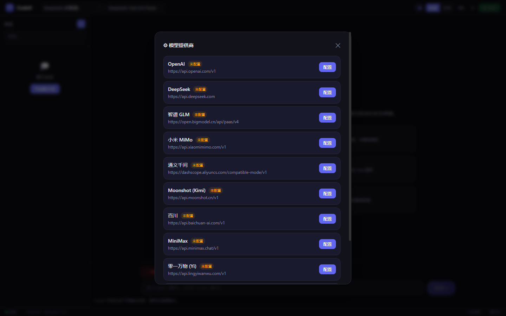
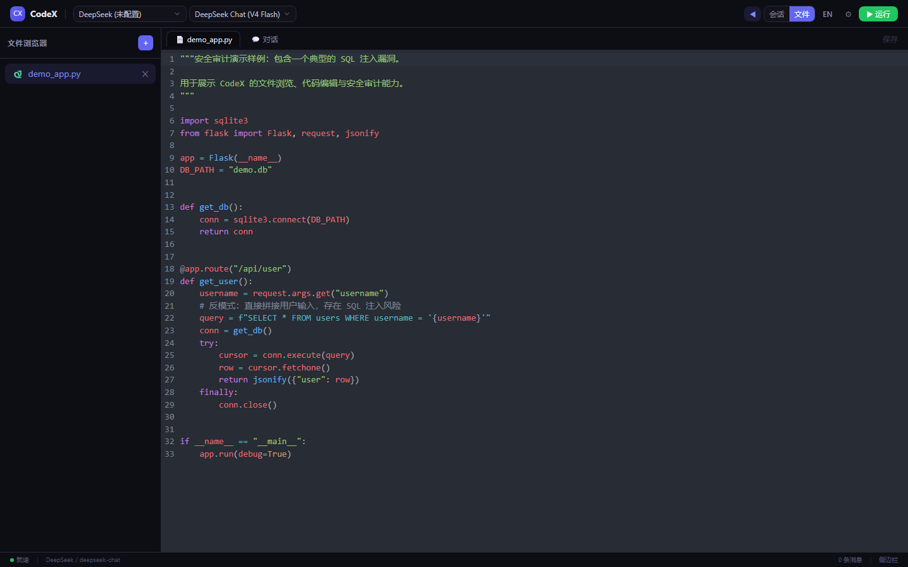
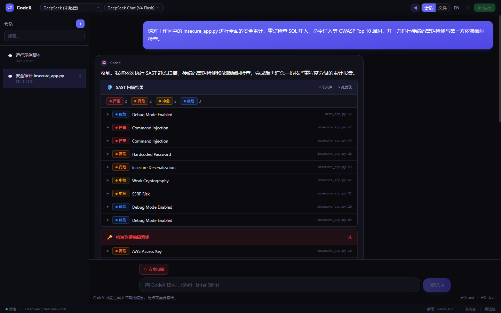
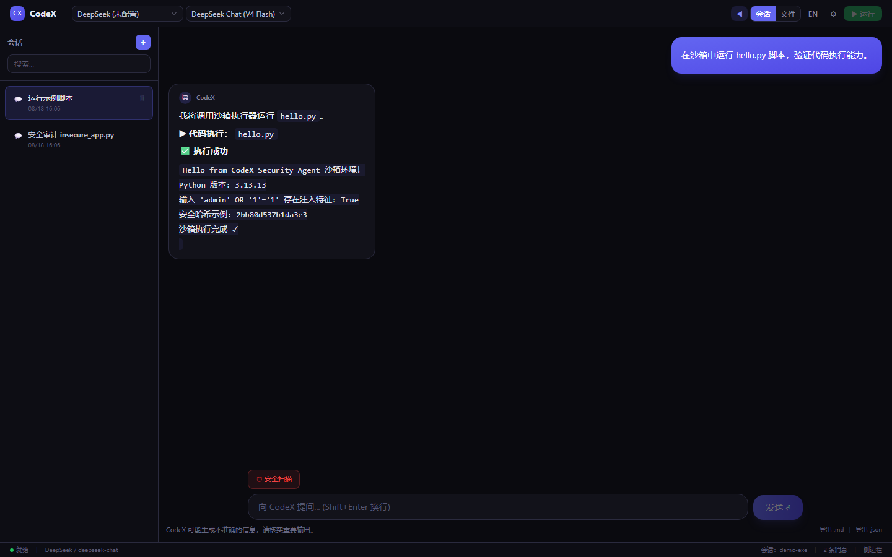
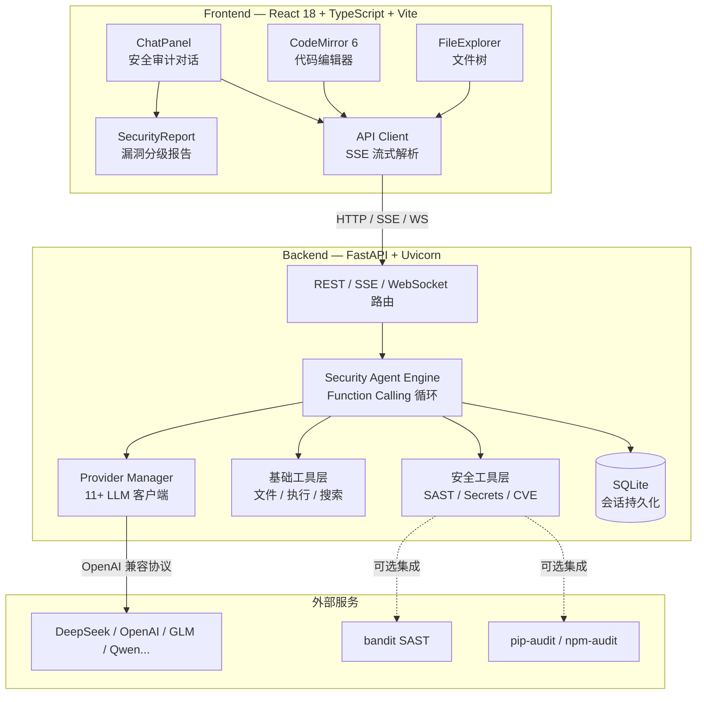
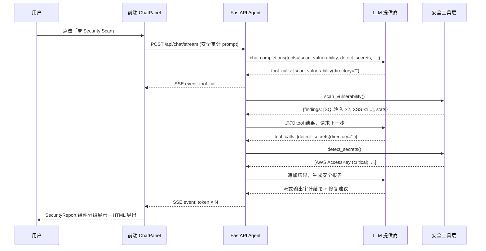

# CodeX Security Agent

<p align="center">
  <strong>AI 驱动的应用安全审计 Agent —— 基于 Function Calling 的自主安全审计引擎，集成 SAST 静态扫描、硬编码密钥检测与依赖漏洞检查。</strong>
</p>

<p align="center">
  <a href="#-项目亮点"></a>
  <a href="#-安全工具链"></a>
  <a href="https://github.com/wyqsgy/codex-agent/blob/main/LICENSE"></a>
  
  
  
  
  
  
  
</p>

---

## 项目背景

传统的代码漏洞扫描工具（如 Semgrep、CodeQL、bandit）只能**机械地匹配已知模式**，无法理解业务上下文，也无法与开发者交互。CodeX Security Agent 将 **大语言模型的推理能力** 与 **自动化安全工具链** 结合，构建了一个能**自主规划安全审计流程、理解漏洞语义、提供可落地修复方案**的 Agent。

LLM 通过 **原生 Function Calling** 调用安全工具（SAST 扫描、密钥检测、依赖漏洞检查），在多轮工具调用循环中主动发现、验证并修复代码中的安全问题——而不是简单地输出一段提示文本。

## 📸 功能展示

| 中文主界面 | 中英双语切换 |
|:-:|:-:|
|  |  |

| 多模型提供商配置 | 代码编辑器 / 文件浏览器 |
|:-:|:-:|
|  |  |

| 安全审计报告（漏洞分级） | 沙箱代码执行 |
|:-:|:-:|
|  |  |

## ✨ 项目亮点

- **自主安全审计 Agent**：LLM 通过 Function Calling 自主规划审计流程（探测 → 扫描 → 验证 → 修复），最大 8 轮迭代
- **SAST 静态扫描**：内置 OWASP Top 10 漏洞模式（SQL 注入、命令注入、XSS、SSRF、路径穿越、弱加密、不安全反序列化），并可无缝集成 bandit
- **硬编码密钥检测**：17+ 条敏感信息规则，覆盖 AWS/阿里云/腾讯云 AccessKey、GitHub Token、私钥、数据库连接串、JWT、Slack Webhook 等
- **依赖漏洞检查**：内置 CVE 数据库 + 集成 pip-audit / npm-audit，识别已知漏洞的第三方库
- **真正的流式体验**：SSE + WebSocket 双通道，Token 级流式输出，工具调用状态实时推送，支持中途取消
- **代码沙箱执行**：子进程隔离执行 Python / JavaScript / TypeScript，带超时、输出截断与运行时探测
- **多层安全防护**：目录穿越拦截（`safe_path`）、频率限制、API Key 环境变量隔离、Docker 非 root 运行
- **HTML 安全报告导出**：一键生成带严重程度分级的专业安全审计报告
- **多模型热切换**：内置 11 家提供商（DeepSeek / OpenAI / 智谱 / 通义 / Kimi…），支持自定义 OpenAI 兼容端点

## 🛡 安全工具链

CodeX Security Agent 的核心是三个通过 Function Calling 暴露给 LLM 的安全工具：

| 工具 | 功能 | 检测能力 |
|------|------|---------|
| `scan_vulnerability` | SAST 静态代码扫描 | SQL 注入、命令注入、XSS、SSRF、路径穿越、硬编码密码、弱加密、不安全反序列化、调试模式、CORS 配置错误 |
| `detect_secrets` | 硬编码密钥检测 | AWS/阿里云/腾讯云 AccessKey、GitHub/GitLab/Slack Token、私钥、数据库连接串、JWT、Telegram Bot Token |
| `check_dependencies` | 依赖漏洞检查 | 内置 CVE 库 + pip-audit（Python）+ npm-audit（Node.js） |

每次扫描都会输出结构化的漏洞报告，包含严重程度分级（critical / high / medium / low）、文件路径、行号、漏洞描述和修复建议，并可导出为 HTML 报告。

## 📐 系统架构



### 一次安全审计的完整时序



## 🧠 核心设计

### 1. 安全审计 Agent 循环

```python
# agent.py — 核心循环（简化）
for _ in range(MAX_TOOL_ITERATIONS):      # 最多 8 轮
    response = client.chat.completions.create(messages=..., tools=SECURITY_TOOLS)
    choice = response.choices[0]

    if not choice.message.tool_calls:
        break                              # 完成审计，输出报告

    for tc in choice.message.tool_calls:
        result = await call_tool(tc.function.name, json.loads(tc.function.arguments))
        messages.append({                 # 将扫描结果回填给 LLM
            "role": "tool", "tool_call_id": tc.id, "content": json.dumps(result),
        })
```

### 2. 密钥检测引擎

基于正则的 17+ 条敏感信息规则，借鉴 truffleHog / gitleaks 的设计思路，支持：
- 云厂商 AccessKey（AWS `AKIA`、阿里云 `LTAI`、腾讯云 `AKID`）
- 版本控制 Token（GitHub `ghp_`、GitLab `glpat-`）
- 通信凭证（Slack、Telegram、Slack Webhook）
- 数据库连接串、私钥、JWT

每条规则都附带严重程度分级，检测结果包含上下文片段，便于人工确认。

### 3. 多层安全防护

| 威胁 | 防护措施 | 实现位置 |
|------|---------|---------|
| 目录穿越攻击 | `safe_path()` 规范化路径 + 前缀校验 | `tools.py` |
| 二进制/大文件读取 | 扩展名黑名单 + 5MB 大小限制 | `tools.py` |
| 请求滥用 | 60 次/分钟滑动窗口限流 | `main.py` |
| 密钥泄露 | API Key 仅环境变量读取 | `config.py` |
| 容器逃逸 | Docker 非 root 用户 + 最小镜像 | `Dockerfile` |
| 代码执行逃逸 | 子进程隔离 + 超时 + 输出截断 | `tools.py` |

## 🛠 技术栈

| 层 | 技术 | 选型理由 |
|----|------|---------|
| 后端框架 | FastAPI + Uvicorn | 原生异步、自动 OpenAPI、SSE/WS 支持 |
| Agent | OpenAI SDK (Function Calling) | 统一多提供商兼容层 |
| 数据库 | SQLite (aiosqlite) | 零部署、适合单机持久化 |
| 前端 | React 18 + TypeScript 5 | 类型安全 + 组件化 |
| 构建 | Vite 5 | 极速 HMR + 代码分割 |
| 编辑器 | CodeMirror 6 | 模块化、支持 8 种语言 |
| 样式 | Tailwind CSS 3 | 原子化 CSS，快速迭代 |
| Markdown | react-markdown + remark-gfm | 表格/引用/任务列表 |
| 图表 | Mermaid 11 | 对话内渲染架构图/时序图 |
| 安全工具 | bandit / pip-audit / npm-audit | 工业级 SAST / 依赖扫描（可选集成） |
| 部署 | Docker 多阶段构建 | 镜像瘦身 + 非 root 运行 |

## 🚀 快速开始

### 前置要求

- Python 3.11+
- Node.js 18+（本地执行 JS/TS 代码需要）
- （可选）Docker & Docker Compose
- （可选）`pip install bandit pip-audit` 启用深度扫描

### 方式一：Docker 部署（推荐）

```bash
# 1. 配置 API Key
cp backend/.env.example backend/.env
# 编辑 backend/.env 填入你的 API Key

# 2. 一键启动
docker compose up --build
```

访问 `http://localhost:8000/docs` 查看交互式 API 文档。

### 方式二：本地开发

```bash
# 后端
cd backend
pip install -r requirements.txt
cp .env.example .env          # 填入 API Key
python -m uvicorn main:app --host 0.0.0.0 --port 8000 --reload

# 前端（新终端）
cd frontend
npm install
npm run dev
```

前端 `http://localhost:5173`，通过 Vite proxy 将 `/api` 转发到后端。启动后点击「🛡 Security Scan」按钮即可对工作区代码进行安全审计。

## 📚 API 接口

| 方法 | 路径 | 说明 |
|------|------|------|
| `POST` | `/api/chat` | 对话（非流式） |
| `POST` | `/api/chat/stream` | 对话（SSE 流式）——安全审计入口 |
| `GET` | `/api/conversations` | 会话列表 |
| `GET` | `/api/conversations/{id}` | 会话详情 |
| `DELETE` | `/api/conversations/{id}` | 删除会话 |
| `GET` | `/api/files` | 文件列表 |
| `POST` | `/api/files/read` | 读取文件 |
| `POST` | `/api/files/write` | 写入文件 |
| `POST` | `/api/files/delete` | 删除文件 |
| `POST` | `/api/execute` | 执行代码 |
| `POST` | `/api/search` | 搜索代码 |
| `GET` | `/api/providers` | 提供商列表 |
| `POST` | `/api/providers/configure` | 配置提供商 |
| `GET` | `/api/providers/{id}/test` | 测试连接 |
| `GET` | `/api/stats` | 运行统计 |
| `GET` | `/api/health` | 健康检查 |
| `WS` | `/ws/chat` | WebSocket 对话 |

> 安全工具（`scan_vulnerability` / `detect_secrets` / `check_dependencies`）通过 Function Calling 暴露给 Agent，由 LLM 在对话中自主调用，前端 `SecurityReport` 组件自动渲染扫描结果。

## 🧪 测试

项目包含完整的单元测试与集成测试，覆盖工具层、Agent 引擎与 API 层。

```bash
cd backend
pip install -r requirements-dev.txt

pytest                          # 运行全部测试
pytest --cov=. --cov-report=term-missing   # 查看覆盖率明细
```

测试覆盖的关键场景：
- ✅ 路径穿越攻击（`../`、绝对路径、多级穿越）
- ✅ 二进制文件读取拦截
- ✅ 代码执行超时与不支持语言
- ✅ 文件增删改查
- ✅ API 限流（429）
- ✅ 会话持久化与恢复
- ✅ 安全工具注册（9 个工具）

## 📁 项目结构

```
codex-agent/
├── backend/                       # FastAPI 后端
│   ├── main.py                    # 路由、中间件、SSE/WS
│   ├── agent.py                   # 安全审计 Agent 引擎（Function Calling 循环）
│   ├── tools.py                   # 工具实现（基础 + 安全工具）
│   ├── config.py                  # 配置与提供商管理
│   ├── models.py                  # Pydantic 数据模型
│   ├── providers.json             # 内置 11 家模型提供商
│   └── tests/                     # 单元测试 + 集成测试
├── frontend/                      # React 前端
│   └── src/
│       ├── App.tsx                # 主应用（状态管理/布局）
│       ├── api.ts                 # API 客户端 + SSE 流式处理
│       ├── types.ts               # TypeScript 类型定义
│       └── components/
│           ├── ChatPanel.tsx      # 聊天面板（Markdown/Mermaid/导出）
│           ├── SecurityReport.tsx # 安全报告（SAST/密钥/依赖分级展示）
│           ├── ConversationSidebar.tsx  # 会话侧边栏
│           ├── CodeEditor.tsx     # 代码编辑器（CodeMirror 6）
│           ├── FileExplorer.tsx   # 文件浏览器
│           ├── MermaidDiagram.tsx # Mermaid 图表渲染
│           ├── StatusBar.tsx      # 状态栏
│           ├── ErrorBoundary.tsx  # 错误边界
│           └── Toast.tsx          # 通知组件
├── .github/workflows/ci.yml       # CI/CD（pytest + tsc + build）
├── Dockerfile                     # 多阶段构建（非 root 运行）
├── docker-compose.yml             # 一键部署
└── workspace/                     # 默认工作区
```

## 🐳 部署架构

Docker 采用**多阶段构建**：

1. **Stage 1（构建前端）**：`node:20-alpine` 编译生成静态资源
2. **Stage 2（运行时）**：`python:3.11-slim` 仅保留运行时依赖，安装 Node.js 用于 JS/TS 代码执行
3. **安全加固**：创建非 root 用户运行，健康检查探针，数据卷持久化

## 📜 License

[MIT](LICENSE) © 2026 wyqsgy